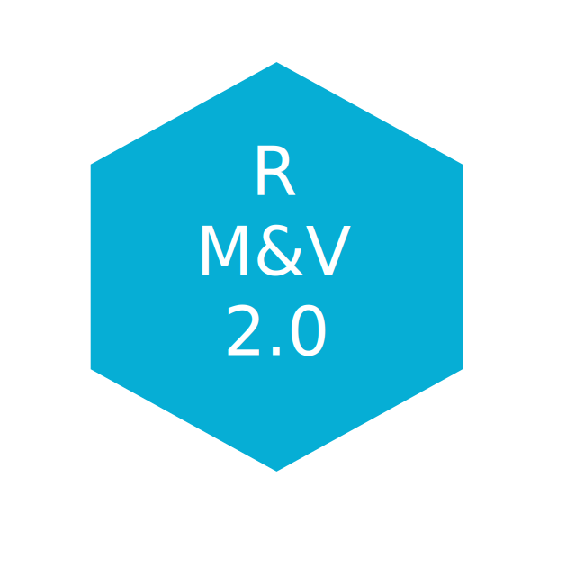

<p align="center"></p>

# RMV2.0 - LBNL M&V2.0 Tool

***

**RMV2.0** is an open-source [R](https://cran.r-project.org/) package for performing
advanced measurement and verification 2.0 (M&V 2.0)for Commercial Buildings. Aimed to run
locally, the package provides algorithms and a graphical user interface (GUI)
that is browser-based and the data analysis is fully contained within the user’s 
hardware (no data or results are uploaded to the internet). 
The intent of the package is to help M&V practitioners to perform with a high level of automation the following:
* Quickly and easily summarize and visualize smart meter data.
* Create energy consumption baseline models using advanced algorithms.
* Screen smart meter data for commercial customers to identify buildings that
are well suited to the automated M&V approach; use this information to target
future whole-building projects.
*  Estimate savings.
*  Identify potential non-routine events (NRE) in the post-installation period
using statistical methodology.


## Installation

To install **RMV2.0** package the user is required to install:
* [R](https://cran.r-project.org/) (version 3.4.2 or later), which is an open source programming language and software environment for statistical computing
* A web browser such as Chrome, Firefox or Safari
* [RStudio](https://www.rstudio.com/), which is an open source integrated development environment (IDE) for R
* [devtools](https://cran.r-project.org/web/packages/devtools/index.html) R package, which is providing R functions that simplify R package installation from github

Once [R](https://cran.r-project.org/) and [RStudio](https://www.rstudio.com/) are installed, open [RStudio](https://www.rstudio.com/) and install the [devtools](https://cran.r-project.org/web/packages/devtools/index.html)
package by running in the console the following command:
```r
install.packages("devtools")
```
Install the **RMV2.0** package using the following command:
```r
devtools::install_github("LBNL-ETA/RMV2.0")
```

## For More Information

Check out the [project site](https://lbnl-eta.github.io/RMV2.0/) for all the details like