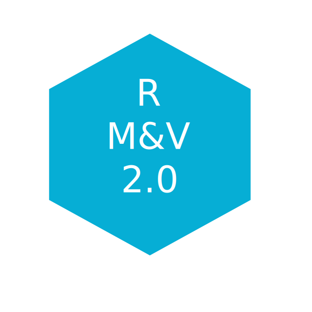

<p align="center"></p>
--------------------------------------------------------------------------------

# RMV2.0 - LBNL M&V2.0 Tool

***

Table of Contents:
----
+ [**Introduction**](#introduction)
+ [**Installation**](#installation)
+ [**Input Data Format**](#input-data-format)
    + [Timestamps Format](#timestamps-format)
    + [Handling Holidays/Vacations Periods](#handling-holidays/vacations-periods)
+ [**RMV2.0 Using the graphical user interface (GUI)**](#RMV2.0-Using-the-graphical-user-interface-(GUI))
    + [Screening Analysist](#screening-analysis)
        + [New Screening Analysis Project](#New-screening-analysis-project)
        + [Data Overview](#data-overview-sc)
        + [Create Baseline Models](#create-baseline-models-sc)
        + [Baseline Modeling Results Summary](#baseline-modeling-results-summary-sc)
        + [Screen Buildings Based on Goodness of Fit Thresholds](#Screen-Buildings-Based-on-Goodness-of-Fit-Thresholds)
        + [Results Summary](#Results-summary)
        + [Saving the Project](#Saving-the-Project)
        + [Load an Existing Screening Project](#Load-an-existing-screening-project)
    + [Savings Analysis](#Savings-Analysis)
        + [New Savings Analysis Project](#New-savings-analysis-project)
        + [Data Overview](#data-overview-sav)
        + [Create Baseline Models](#create-baseline-models-sav)
        + [Baseline Modeling Results Summary](#baseline-modeling-results-summary-sav)
        + [Savings Estimations](#savings-estimations)
        + [Potential Non-Routine Events Identification](#potential-nre-identification)
        + [Results Summary](#Results-summary-sav)
        + [Saving the Project](#saving-the-project-sav)
        + [Load an Existing Screening Project](#load-an-existing-screening-project-sav)
+ [**RMV2.0 Using R Scripting**](#RMV2.0-Using-r-scripting)
+ [**Appendix**](#appendix)
+ [**References**](#references)


## Introduction

**RMV2.0** is an open-source [R](https://cran.r-project.org/) package for performing
advanced measurement and verification 2.0 (M&V 2.0)for Commercial Buildings. Aimed to run
locally, the package provides algorithms and a graphical user interface (GUI)
that is browser-based and the data analysis is fully contained within the user’s 
hardware (no data or results are uploaded to the internet). 
The intent of the package is to help M&V practitioners to perform with a high level of automation the following:
* Quickly and easily summarize and visualize smart meter data.
* Create energy consumption baseline models using advanced algorithms.
* Screen smart meter data for commercial customers to identify buildings that
are well suited to the automated M&V approach; use this information to target
future whole-building projects.
*  Estimate savings.
*  Identify potential non-routine events (NRE) in the post-installation period
using statistical methodology.


## Installation

To install **RMV2.0** package the user is required to install:
* [R](https://cran.r-project.org/) (version 3.4.2 or later), which is an open source programming language and software environment for statistical computing
* A web browser such as Chrome, Firefox or Safari
* [RStudio](https://www.rstudio.com/), which is an open source integrated development environment (IDE) for R
* [devtools](https://cran.r-project.org/web/packages/devtools/index.html) R package, which is providing R functions that simplify R package installation from github

Once [R](https://cran.r-project.org/) and [RStudio](https://www.rstudio.com/) are installed, open [RStudio](https://www.rstudio.com/) and install the [devtools](https://cran.r-project.org/web/packages/devtools/index.html)
package by running in the console the following command:
```r
install.packages("devtools")
```
Install the **RMV2.0** package using the following command:
```r
devtools::install_github("LBNL-ETA/RMV2.0")
```

## Input Data Format
To correctly the calculation within the **RMV2.0** package, it is required from the user to provide a specific format of input data, which are the pre and post period data (note that only pre period are required when screening project is performed). The input data should be loaded as csv files that have a specific tabular format. These files should have at least three columns: 

1. *time*: timestamps of the time series using "*month/day/last two digits of the year*" format (i.e., "%m/%d/%y %H:%M" format)
2. *eload*: energy consumption values 
3. *Temp*: outside air temperature values

Basically the first line of the csv files will look like the following: 
```r
"time","eload","Temp"
"1/1/14 23:00",24.17,52.6
"1/1/14 23:15",24.95,52.1
```
which correspond to the following table:

| time        | eload | Temp |
| ------------|:-----:| ----:|
| 1/1/14 23:00 | 24.17 | 52.6 |
| 1/1/14 23:15 | 24.95 | 52.1 |

Note that the first line of the files should always contain the *time*,*eload* and *Temp* headers and it is letter case sensitive. If more variables are available, it's possible to add them to the model by adding them as new columns in the input data files and
provide their names to the algorithm (this will be discussed later). The user can fins a examples of these files  within the *RMV2.0/data* folder.

The user should avoid in the input data files: 
* Rows with missing values 
* Duplicates in the time column (i.e., timetampes) 


#### Timestamps Format

For convenience, an R function is included with the package to convert the actual
timestamps format into "\%m/\%d/\%y \%H:\%M" format. To do so one should use the
timestamp formatting used by the base R function *strptime* to define the format.
For example converting a table (i.e., "data") that include a time column with the following
timestamp format "2013-08-01 00:00:00" into a table with "1/8/13 00:00" format:

```r
data <- time_format(data,"%Y-%m-%d %H:%M:%S")
```

#### Handling Holidays/Vacations Periods
There are two different mechanisms to create an additional binary variable that will differentiate holidays/vacations from the rest of the observation. The first approach is to use a csv file where the holidays/vacations dates are indicated. The format of this csv file is defined as follow:

```r
date
"2007/7/4"
"2007/9/3"
"2007/10/8"
```
An example corresponding to the US federal holidays is provided in *RMV2.0/inst/extdata* folder. Note that this approach does not make a difference between vacations and holidays. The second approach is more flexible and can generate different binary variables based on time intervals, e.g. one for vacations and one for holidays. To do so, use create_date_var function from **RMV2.0** package.  This function can be used as:

```r
start <- c("1/1/14 3:15", "1/20/14 0:00")
end <- c("1/3/14 0:00","1/21/14 17:00")
Data_with_new_variable <- RMV2.0::create_date_var(Data,start=start,
						end=end,
						var_name = "new_variable")
```
where start is a vector that correspond to the beginning of each interval and end a vector that correspond to the end of each interval.

## RMV2.0 Using the graphical user interface (GUI)

To launch the RMV2.0 GUI there are two options, the first one is by using the following command in **Rstudio**:
```r
RMV2.0:::runRMV_UI()
```
The second option is to select the RMV2.0 from the [*Addins*](https://rstudio.github.io/rstudioaddins/) menu in Rstudio:


<p align="center"></p>

The **RMV2.0** GUI will open in the default web browser. The startup dashboard will display the RMV2.0 logo in the main body and the sidebar (on the left) with two clickable tabs:  the home tab and the project setup tab. 

<p align="center"></p>

To create a new project or to open an existing one the user needs to click on the project setup menu item, which switches the content in the main body to the following tab:  

<p align="center"></p>

Within the **Project Type** box the user can define the type of the project (i.e., Screening or Savings analysis) and specify if it is a new project that needs to be created or an existing one that needs to be loaded. When the appropriate options are selected the user needs to click on the **Next Step** button to continue. In the following subsections we will describe the subsequent steps depending on the selected options. Note that in order to make the Screening and Savings analysis sections self-sufficient, the reader will find a lot of redundancy between these two sections.

### Screening Analysis

The screening process consists on the selection of specific buildings for recruitment into a specific energy efficiency program. This process is usually performed before the program’s retrofits are implemented in order to select the buildings for which the usage of statistical baseline model as M&V tool (M&V option C) is suitable to produce accurate savings estimates. This screening is based on the assessment of the goodness of fit of baseline models using industry standard metrics (i.e., R2, CV (RMSE) and NMBE). 

#### New Screening Analysis Project

After selecting the appropriate settings in the **Project Type** box, a new box will appear in the main body of the dashboard. The user will be then asked to provide a project name (a default name will be proposed), to select the directory where the results of the study will be saved and to select the directory where the pre-installation data are stored.

<p align="center"></p>

Note that as long as the directories, which corresponds to where the results will be saved and the pre-installation data, are not defined the top of the corresponding tabs will display an orange bar. Once this is done (by clicking on the Browse button) the color will switch to green, and a **Next Step** button will appear at the bottom of the box.

<p align="center"></p>

By clicking on the **Next Step** button, the pre-installation data files will be loaded into the tool and a message popup will appears indicating if the project setup is completed or if the tool encountered an error.  In addition, new menu items will appear in the sidebar as well as **Save** button, which can be used at any step of the analysis to save the project.

<p align="center"></p>

#### Data Overview <a id="data-overview-sc"></a>
The user can obtain an overview of the loaded pre-installation data by selecting the **Input Data Overview** menu tab. Within this tab basic summary of the data along with some useful charts are displayed: 

<p align="center"></p>

The upper box (i.e., **Pre-installation data summary**) displays a table with basic information for each building of the studied dataset: the name of the building; the date of the beginning and the end of the time series (i.e., *Start Date*, *End Date*); the total number of days available in the time series; the percentage of missing data within the time series (note that by missing data we mean periods of time where no observations were available); the granularity of the measured data (i.e., Time Interval); and finally, the number of columns that are available (i.e., Input Variable, note that if this number is equal to 3 it means that there is only the *time*, *eload* and the *Temp* as columns).

Within the lower box (i.e., **Pre-installation data plots**) the user can visualize the data for each  building by selecting the name of the building for which the plots will be generated in the drop-down (i.e., **Choose Data to Visualize** box).  Three different type of plots are available: 

1. A standard time series plot (i.e., **Time Series Pre-Installation**) that displays simultaneously the energy consumption and the temperature.

<p align="center"></p>

2. A scatter plot that displays the energy data vs. an independent variable; the user can select the independent variable from the list of the available ones.

<p align="center"></p>

3. A heatmap where the horizontal axe represents the time of the week and the vertical axe represents a date that correspond to the Monday of each week of the period that is covered by the data. Note that the missing data are displayed in white color.  

<p align="center"></p>

#### Create Baseline Models <a id="create-baseline-models-sc"></a>

The **Train Baseline Models** tab is designed to provides the user the necessary tools to set-up and run the baseline model generation process.  The user can select between two baseline models the *TOWT* model and the *GBM* model (refer to the appendix for more information about these models). The type of model can be select from the drop-down menu in the **Select Baseline Model** box. Depending on the considered model different option will be available. For the *TOWT* model the only available option is to modify one hyper-parameter.

<p align="center"></p>

For the *GBM* model, in addition to the capability of modifying the hyper-parameters the user can also add an additional independent variable (if not already present in the original data file) that represents vacation/days off. This can be done either by using a default file of US federal vacation or by specifying the file that contains this information (as described in section 3). In order to decrease the computational time, the *GBM* model can be run on parallel CPU cores (not threads). This parallelization is done for the k-folds cross validation tuning process (e.g., if the user is using a computer that has a CPU with 5 cores and the numbers of folds in the cross validation is setup to be equal to 5 then the 5 data combinations of the 5-folds cross validation process will be evaluated in parallel on the 5 CPU cores).  It is important to note that the maximum number of cores that can be used is equal to the number of folds of the k-folds cross validation (e.g., if k=10 then the maximum CPU cores that can be used is 10).

<p align="center"></p>

Once the baseline model settings are defined, the user can launch the training of the baseline models by clicking the button **Train the Baseline Models**. At the end of the baseline models training process a popup will appears indicating if the training was successfully completed or if the algorithm encountered some problems.

<p align="center"></p>


#### Baseline Modeling Results Summary <a id="baseline-modeling-results-summary-sc"></a>

The completion of the baseline model training will release two new menu items in the sidebar: **Baseline Modeling Results** and **Summary**. In addition, a new save button will appear in the sidebar (i.e., **Save Predictions**).

<p align="center"></p>

By clicking on the **Save Predictions** button the user will save the predictions generated by the baseline model in the pre_predictions folder that will be created (if it does not already exist) within the Results folder, which was specified by the user during the project setup step.  

```
Project_Folder
└───Results_Folder
    └───pre_predictions
        │   pre_predictions_buuilding_1.txt
        │   pre_predictions_buuilding_2.txt
        │   ...
```

By clicking on the **Baseline Modeling Results** the user will have access to the results of the baseline models. Thus, in the first box (e.g., Goodness of Fit) the statistical metrics (i.e., R2, CVRMSE and NMBE; see appendix for the definition of these metrics) of the goodness of fit are shown. 

<p align="center"></p>

The user can also analyze the results by visualizing different plots (in the **Plot Baseline Model Results** box):

1. Time series plot (i.e., **Time Series Pre-Installation**) that displays simultaneously the energy consumption, the fitted energy consumption and the temperature.

<p align="center"></p>

2. Scatter plot of the actual values of the energy consumption data vs. the fitted values (i.e., **Scatter plot fitting vs. actual**). This plot allows the user to visually assess the accuracy of the fitting.

<p align="center"></p>

3. Scatter plot of the model fitting errors (i.e., the residual between the model fit and the actual data) vs a selected independent variable (i.e., **Scatter plot of errors vs. input**). This plot can be used to assess the accuracy of the baseline model against each independent variable and detect if there is any specific region where the model underperforms.

<p align="center"></p>

4. Autocorrelation plot (i.e., **Residuals Autocorrelation Plot**) displays the value of the autocorrelation function (acf). The values of the acf can range from -1 to 1. This plot is used to show whether the residuals are correlated or independent of each other. Each vertical line in the graph correspond to the value of the autocorrelation function for the corresponding lag. If the values at a specific lag is higher (or lower if negative) than the horizontal dashed lines, it means that at this lag the autocorrelation is statistically significant (e.g., significantly different from zero). Note that the user can modify the value of the maximum lag that is displayed. 

<p align="center"></p>


#### Screen Buildings Based on Goodness of Fit Thresholds

Once the goodness of fit results are available the user can check the fraction of buildings that satisfy the threshold criteria. These thresholds values can be modified by the user to match some project specific needs. The resulting fractions of building that do satisfy (i.e., pass) and do not satisfy (i.e., fail) the thresholds are displayed on a pie chart (within the **Screening Results** box). 

<p align="center"></p>

Note that R2 dialog box indicates a minimum target value, while CV (RMSE) and NMBE indicate the maximum values.

#### Results Summary

The last menu item that is available for a screen analysis is the **Summary**. Within this tab the user can visualize for each building the time series of the actual and the fitted values of the energy consumption and the goodness of fit metrics.

<p align="center"></p>

#### Saving the Project

The user can save the project at any time during the analysis (it is preferable to save the project at the end of each step of the analysis). This can be done by clicking on the **Save Project** button in the sidebar. The project will be saved as an .rds file within the Results folder, which was specified by the user during the project setup step. Note that depending on the number of buildings the time necessary to save the full project can be significant. During the saving process a popup in the lower right corner of the dashboard will indicate that the saving is in progress.

<p align="center"></p>

The user can use the saved .rds file at a later time to check the results (see bellow). It is also possible to communicate the results by sharing the .rds file. 

#### Load an Existing Screening Project

After selecting the appropriate settings in the **Project Type** box (i.e., **Screening** and **Open an Existing Project**), a new box will appear in the main body of the dashboard. The user will be then asked to provide path of the .rds file where the results of the study have been saved. While the project is loading a popup in the lower right corner of the dashboard will indicate that the loading is in progress. Note that depending on the number of studied buildings the time necessary to load the full project can be significant.

<p align="center"></p>

Once the project is loaded a popup will appear on the top right side of the dashboard, and the user can review the results of the analysis using the same tools described in the previous section (e.g., New project screening analysis). Note that the tab **Train Baseline Models** will not be accessible to the user because it is not possible to rerun the models training process when a project is loaded. 

<p align="center"></p>

### Savings Analysis

In the M&V process, savings estimation consists in calculating the difference between the actual energy consumption and the energy consumption that would have been if energy efficiency measures had not been implemented. This can be done by using a baseline model.

#### New Savings Analysis Project

After selecting the appropriate settings in the **Project Type** box (i.e., **Savings Analysis** and **Create a New Project**), a new box will appear in the main body of the dashboard. The user will be then asked to provide a project name (a default name will be proposed), to select the directory where the results of the study will be saved, to select the directory where the pre-installation data are stored and to select the directory of where the post-installation data are stored.

<p align="center"></p>

Note that as long as the directories are not defined the top of the corresponding tabs will display an orange bar. Once this is done (by clicking on the Browse button) the color will switch to green, and a next step button will appear at the bottom of the box.

<p align="center"></p>

After clicking on the Next Step button, the pre-installation and post-installation data files will be loaded into the tool and a  popup will appears, in the top right corner of the dashboard, indicating if the project setup is completed or if the tool encountered an error.  In addition, new menu items will appear in the sidebar as well as Save button, which can be used at any step of the analysis to save the project.

<p align="center"></p>

#### Data Overview <a id="data-overview-sav"></a>

The user can obtain an overview of the loaded data by selecting the **Input Data Overview** tab. Within this tab basic summary of the data along with some useful charts are displayed.

<p align="center"></p>

The upper two boxes, respectively **Pre-installation data summary** and **Post-installation data summary**, display tables with basic information of pre and post-installation data for each building: the name of the building; the date of the beginning and the end of the time series (i.e., *Start Date*, *End Date*); the total number of days available in the time series; the percentage of missing data within the time series (note that by missing data we mean periods of time where no observations were available); the granularity of the measured data (i.e., Time Interval); and finally, the number of columns that are available (i.e., Input Variable, note that if this number is equal to 3 it means that there is only the *time*, *eload* and the *Temp* as columns).

Within the lower boxes (i.e., **Pre-installation data plots** and  **Post-installation data plots**) the user can visualize the data for each  building by selecting the name of the building for which the plots will be generated in the drop-down (i.e., **Choose Data to Visualize** box).  Three different type of plots are available: 

1. Standard time series plots (i.e., **Time Series Pre-Installation** and **Time Series Post-Installation**) that display simultaneously the energy consumption and the temperature.

<p align="center"></p>

2. Scatter plots that display the energy data vs. an independent variable; the user can select the independent variable from the list of the available ones.

<p align="center"></p>

3. Heatmaps where the horizontal axe represents the time of the week and the vertical axe represents a date that correspond to the Monday of each week of the period that is covered by the data. Note that the missing data are displayed in white color.  

<p align="center"></p>

#### Create Baseline Models <a id="create-baseline-models-sav"></a>

The **Train Baseline Models** tab is designed to provides the user the necessary tools to set-up and run the baseline model generation process.  The user can select between two baseline models the *TOWT* model and the *GBM* model (refer to the appendix for more information about these models). The type of model can be select from the drop-down menu in the **Select Baseline Model** box. Depending on the considered model different option will be available. For the *TOWT* model the only available option is to modify one hyper-parameter.

<p align="center"></p>

For the *GBM* model, in addition to the capability of modifying the hyper-parameters the user can also add an additional independent variable (if not already present in the original data file) that represents vacation/days off. This can be done either by using a default file of US federal vacation or by specifying the file that contains this information (as described in section 3). In order to decrease the computational time, the *GBM* model can be run on parallel CPU cores (not threads). This parallelization is done for the k-folds cross validation tuning process (e.g., if the user is using a computer that has a CPU with 5 cores and the numbers of folds in the cross validation is setup to be equal to 5 then the 5 data combinations of the 5-folds cross validation process will be evaluated in parallel on the 5 CPU cores).  It is important to note that the maximum number of cores that can be used is equal to the number of folds of the k-folds cross validation (e.g., if k=10 then the maximum CPU cores that can be used is 10).

<p align="center"></p>

Once the baseline model settings are defined, the user can launch the training of baseline models by clicking the button **Train the Baseline Models**. At the end of the baseline models training process a popup will appears indicating if the training was successfully completed or if the algorithm encountered some problems.

<p align="center"></p>

#### Baseline Modeling Results Summary <a id="baseline-modeling-results-summary-sav"></a>

The completion of the baseline model training will release two new menu items in the sidebar: **Baseline Modeling Results** and **Savings Estimations**. In addition, a new save button will appear in the sidebar (i.e., **Save Predictions**).

<p align="center"></p>

By clicking on the **Save Predictions** button the user will save the predictions generated by the baseline model for both pre and post-installation periods. The predictions files will be  saved in the pre_predictions and post_predictions folders that will be created (if they do not already exist) within the Results folder, which was specified by the user during the project setup step.  

```
Project_Folder
└───Results_Folder
    └───pre_predictions
    │   │   pre_predictions_buuilding_1.txt
    │   │   pre_predictions_buuilding_2.txt
    │   │   ...
    │
    └───post_predictions
    │   │   post_predictions_buuilding_1.txt
    │   │   post_predictions_buuilding_2.txt
    │   │   ...
```

By clicking on the **Baseline Modeling Results** the user will have access to the results of the baseline models. Thus, in the first box (e.g., *Goodness of Fit*) the statistical metrics (i.e., R2, CVRMSE and NMBE; see appendix for the definition of these metrics) of the goodness of fit are shown. 

<p align="center"></p>

The user can also analyze the results by visualizing different plots (in the **Plot Baseline Model Results** box):

1. Time series plot (i.e., **Time Series Pre-Installation**) that displays simultaneously the energy consumption, the fitted energy consumption and the temperature.

<p align="center"></p>

2. Scatter plot of the actual values of the energy consumption data vs. the fitted values during the pre-installation period (i.e., **Scatter plot fitting vs. actual**). This plot allows the user to visually assess the accuracy of the fitting.

<p align="center"></p>

3. Scatter plot of the model fitting errors (i.e., the residual between the model fit and the actual data during the pre-installation period) vs a selected independent variable (i.e., **Scatter plot of errors vs. input**). This plot can be used to assess the accuracy of the baseline model against each independent variable and detect if there is any specific region where the model underperforms.

<p align="center"></p>

4. Autocorrelation plot (i.e., **Residuals Autocorrelation Plot**) displays the value of the autocorrelation function (acf). The values of the acf can range from -1 to 1. This plot is used to show whether the residuals are correlated or independent of each other. Each vertical line in the graph correspond to the value of the autocorrelation function for the corresponding lag. If the values at a specific lag is higher (or lower if negative) than the horizontal dashed lines, it means that at this lag the autocorrelation is statistically significant (e.g., significantly different from zero). Note that the user can modify the value of the maximum lag that is displayed. 

<p align="center"></p>

#### Savings Estimations

For conducting a savings analysis, the user should click on the **Savings Estimations** menu item, and then when the corresponding dashboard tab is open click on the Estimate Savings button.  Once the computation of savings estimates is done a table with these estimates will appear on the right of the Savings Estimations box. Within this table the user can find the estimated savings in kWh the fractional saving (FS) in percentage for each building. These two metrics are calculated as follow:

**<center> savings = Ê<sub>post</sub> - E<sub>post</sub> </center>**

**<center>FS = savings / Ê<sub>post</sub> </center>**

Where **Ê<sub>post</sub>** is the estimated (using the baseline model) total energy consumption in the post-installation period,  **E<sub>post</sub>** is the actual total energy consumption in the post-retrofit period. Negative values of savings and **FS** indicate that there was an increase in energy consumption during the post-installation period. Note that in addition to these two metrics the goodness of fit metrics are also displayed in this table.

<p align="center"></p>

The FS results can also be visualized for the whole batch of buildings on a bar plot where the buildings FS are displayed in an ascendant order from left to right

<p align="center"></p>

Additional plots to assess the savings behavior for each building are available. These plots can for example provide information about the seasonality of the savings:

1. The user can visualize the time series of the savings at different granularities (i.e., original interval of the data, daily, weekly or monthly). 

<p align="center"></p>

2. Cumulative sum of the savings (i.e., **Savings CUSUM Plot**), which is also can be plotted at different granularities. Positive values represent savings compared to baseline.

<p align="center"></p>

3. Savings heatmap 

<p align="center"></p>

#### Potential Non-Routine Events Identification <a id="potential-nre-identification"></a> 

Commonly encountered in building’s energy consumption time series, non-routine events (NRE) are associated with fluctuation in occupancy levels, the addition of internal loads such as business-specific equipment, computers and servers, and changes to control and operational strategies that are not part of the efficiency measure. In this tool, we are using change point detection techniques to identify potential non-routine events. Change-points are considered to be the points in the time series where a change in the statistical properties, such as a change in the mean, variance or the distribution, is observed. The algorithm that is used in **RMV2.0** is the pruned exact linear time algorithm (PELT) [[Killick et al. 2012](#killick2012), [Killick et al. 2014](#killick2014)] that is based on dynamic programming and pruning, which has a linear computational complexity. This algorithm follows parametric likelihood framework (in our case Gaussian) to define the objective function that needs to be optimized in order to detect change points.

To identify the potential NRE within **RMV2.0** tool the user needs to open the Non Routine Events tab and then click on the **Check for Potential Non-Routine Events**. Once the computation is done a table with a results summary will appear as well as a popup indicating the number of buildings for which potential NRE were detected. Note that within the summary table the number of detected change points are displayed under *cpts*  (change points) column. 

<p align="center"></p>

The user can also visualize where the potential NRE have been detected by plotting the savings time series with the displayed average savings during periods delimited by the identified change points, which are indicated by vertical black dashed lines. For example, the plot bellow is showing a case where 3 change points have been identified in the savings time series, by pointing the mouse cursor on the redlines the user can obtain the information about how the average savings is changing between different periods. 

<p align="center"></p>

#### Results Summary <a id="results-summary-sav"></a> 

The last menu item that is available for a savings analysis is the summary. Within the summary tab the user can visualize the study results either for each building or for the whole portfolio. As a summary of an individual building the following information will be displayed: 1) the goodness of fit metrics;  2) the time series of the actual and the fitted values of the energy consumption during the pre-installation period; 3) the time series of the actual and the predicted values of the energy consumption during the post-installation period; 4) the savings estimate in kWh; 5) the fractional savings (FS) estimate; 6) the number of detected changes points (if any).

<p align="center"></p>

As a summary of the studied portfolio (i.e., batch of buildings) the user will have the choice between displaying the results using the whole batch of buildings or displaying the results using the buildings that have passed the screening process. In both cases the displayed results will show: 1) the bar plot with the FS for each building; 2) the total savings in kWh (across all buildings); 3) the total FS (across all buildings).

<p align="center"></p>

#### Saving the Project  <a id="saving-the-project-sav"></a> 

The user can save the project at any time during the analysis (it is preferable to save the project at the end of each step of the analysis). This can be done by clicking on the **Save Project** button in the sidebar. The project will be saved as an .rds file within the Results folder, which was specified by the user during the project setup step. Note that depending on the number of buildings the time necessary to save the full project can be significant. During the saving process a popup in the lower right corner of the dashboard will indicate that the saving is in progress.

<p align="center"></p>

The user can use the saved .rds file at a later time to check the results (see bellow). It is also possible to communicate the results by sharing the .rds file. 

#### Load an Existing Screening Project <a id="load-an-existing-screening-project-sav"></a> 

After selecting the appropriate settings in the **Project Type** box (i.e., **Screening** and **Open an Existing Project**), a new box will appear in the main body of the dashboard. The user will be then asked to provide path of the .rds file where the results of the study have been saved. While the project is loading a popup in the lower right corner of the dashboard will indicate that the loading is in progress. Note that depending on the number of studied buildings the time necessary to load the full project can be significant.

<p align="center"></p>

Once the project is loaded a popup will appear on the top right side of the dashboard, and the user can review the results of the analysis using the same tools described in the previous section (e.g., New project screening analysis). Note that the tab **Train Baseline Models** will not be accessible to the user because it is not possible to rerun the models training process when a project is loaded. 

<p align="center"></p>


## RMV2.0 Using R Scripting

### To generate baseline models

#### GBM model

In addition to the GUI the user can also use the R scripting to generate GBM baseline models. The **RMV2.0** package has the *gbm_baseline* function that reads the input data clean it from the missing values and outliers (for more details see the help of functions *clean_eload* and *clean_Temp*, which can be accessed by typing *?clean_eload* and *?clean_Temp* in the R consol), build a GBM baseline model and return an gbm_baseline object.
```r
gbm_obj <- gbm_baseline(train_path = "train.csv",
                        pred_path = "pred.csv",
                        days_off_path = "USA_Fed_Holidays.csv",
                        variables = c("Temp","tow")
                        )
```
where *train_path* and *pred_path* are the paths of the input data files of respectively training period and prediction period.   *days_off_path* is the path of the .csv file that contains the dates of the holidays days. The argument *variables* correspond to the variables that will be considered by the function as input variables. In the above example the variables are the default ones, which are the temperature (*Temp*) and the Time Of the Week (*tow*). Note that since the *days_off_path* is provided the algorithm will add automatically a third variable, which is named *"days_off"* that correspond to the US federal holidays. If additional variables are considered the user needs to add the names of these variables to the R vector of the *variables* argument. For example if data of the solar radiation are available the user will need to add this data to the training and prediction data files as a new column and name it, for example *solar_rad*, then the *variables* argument needs to be changed into *c("Temp","tow","solar_rad")*. In this example several parameters of the *gbm_baseline* function are omitted, these parameters correspond to the set up of the cross-validation involved in the tuning process of the GBM model. For more details about this parameters the users are referred to the help of the function (can be accessed by typing *?gbm_baseline* in R consol).


Once the GBM model is built, the user can access to:
* the goodness of fit statistics using the following command:
```r
gbm_obj$goodness_of_fit
```
* to the created xgboost model for the optimal hyper-paramters:
```r
gbm_obj$gbm_model
```
* to the fitted values (training period / pre-intallation period):
```r
gbm_obj$fitting
```
* to the predicted values (post-installation period):
```r
gbm_obj$prediction
```
* to the training/pre-installation data after the cleaning and filtering functions were applied:
```r
gbm_obj$train
```
* to the post-installation data after the cleaning and filtering functions were applied:
```r
gbm_obj$pred
```
* to the table of all the results of the cross validation:
```r
gbm_obj$gbm_cv_results
```
* and to the optimal combination of the hyper-parameters:
```r
gbm_obj$tuned_parameters
```

#### TOWT model

Similarly to the GBM model, the TOWT model can be build using the *towt_baseline* function that reads the input data clean it from the missing values and outliers and return an *towt_baseline* object. Note that the TOWT model only involves the time of the week and temperature input variables. For more detail about the TOWT model the user can refer to the [eetd-loadshape](https://bitbucket.org/berkeleylab/eetd-loadshape) bitbucket repository. The *towt_baseline* function can be used as follow

```r
towt_obj <- towt_baseline(train_path = "train.csv",
                          pred_path = "pred.csv",
                          days_off_path = "USA_Fed_Holidays.csv")
```
Using the *towt_obj* the user can access to similar data as with *gbm_obj*:
* the goodness of fit statistics using the following command
```r
towt_obj$goodness_of_fit
```
*the TOWT trained model ($towt_model)
```r
towt_obj$towt_model
```
* to the fitted values (training period / pre-installation period):
```r
towt_obj$fitting
```
* to the predicted values (post- installation period):
```r
towt_obj$prediction
```
* to the training/pre data after the cleaning and filtering functions were applied:
```r
towt_obj$train
```
* to the prediction/post data after the cleaning and filtering functions were applied:
```r
towt_obj$pred
```

#### To estimate savings

The savings are estimated by subtracting the actual energy consumption from the baseline model predicted energy consumption of the post period. Thus, savings and the corresponding fractional savings can be estimated using the function *savings* as follow:

```r
savings_obj <- savings(baseline_obj)
```
where *baseline_obj* can be either *gbm_obj* or *towt_obj*.

From the *savings_obj* one can extract:
* the estimated savings
```r
savings_obj$savings
```
* and the corresponding fractional savings
```r
savings_obj$frac_savings
```

#### To identify potential non-routine events

The Potential Non-Routine Events are identified using statistical multiple change points algorithm. Change points are considered to be the points in the time series where a change in the statistical properties is observed. This procedure is performed using the *cpt_det* function as follow

```r
nre_obj <- cpt_det(baseline_obj, interval)
```
where *baseline_obj* can be either *gbm_obj* or *towt_obj*, and *interval* is the minimum size of the potential non-routine event that can be identified.

The change points indices can be obtained using:

```r
nre_obj$cpts
```

## Appendix

#### Baseline Models
Baseline energy use models characterize building load or consumption according to key explanatory variables such as time-of-day and weather. These baseline models are used for quantification of energy savings. Baseline model accuracy is critical to the accuracy of energy savings that are calculated according to the IPMVP. For both whole-building and measure isolation approaches (IPMVP Options B and C) the baseline model is created during the pre-installation period, before an efficiency improvement is made. The baseline model is then projected into the post-installation period, and energy savings are calculated based on the difference between the projected baseline and the actual metered use during the post-measure period [[EVO 2012](#evo)]. The RMV2.0 package include two different baseline models algorithm: time of the week and temperature (TOWT) and gradient boosting machine (GBM). In the following these two models are briefly described.

##### GBM Model:
The GBM baseline model [[Touzani et al. 2018](#touzani2018)] is based on the Gradient Boosting Machine (GBM) algorithm that is an ensemble trees based machine learning method. The GBM generate a model of the energy consumption using time and temperature as independent variables. However, the practical advantage of using the GBM model, in comparison to TOWT model, is that it is capable of handling additional independent variables, such as holidays indicator, humidity, or solar radiation. GBM model has several hyper-parameters that needs to be tuned in order to produce an accurate model. As for any machine learning predictive method, over-fitting is a concern for the GBM algorithm. Over-fitting is the tendency of the model to fit the training data too well, at the expense of the predictive accuracy, which means that the estimated pattern is not likely to be generalized to new data points. This happens because an over-fitted model will fit the characteristics of the noise that is present in the training data rather than identifying the general pattern of the input/output relation. The over-fitting is usually the downside of an unnecessary over-complex model. There are four hyper-parameters that need to be tuned: (1) the depth of decision trees, which also controls the maximum interaction order of the model; (2) the number of iterations, which also corresponds to the numbers of decision trees; (3) the learning rate, which is usually a small positive value between 0 and 1, where decreases lead to slower fitting, thus requiring the user to increase the number of iterations; (4) the fraction of data that is used at each iterative step. 
These parameters are tuned automatically using a search grid and a k-folds cross validation procedure. This approach consists of defining a grid of combinations of hyper-parameters values, building a model for each combination, and selecting the optimal combination using metrics that quantify the model performance in term of predictive accuracy. It is clear that it is not advised to use the same observations that have been used as training data to estimate the models to compare the predictive performance. Therefore, one should assess the accuracy on an independent set of data points, which is performed using the k-folds cross validation method. The k-fold cross validation method consists of randomly splitting the training dataset into k subsamples, called folds, of roughly equal size. The first model is estimated using k-1 folds as a training dataset and the held-out fold (test set) is used to estimate the prediction accuracy metric.
In **RMV2.0** package the search grid is pre-defined based on results obtained with previous studies. It is possible to change the definition of this search grid using the Hyper-parameters Setup tab, however for a user that is not familiar with these hyper-parameters, we advise using the default values.

##### TOWT Model:

TOWT [[Mathieu et al 2011](#mathieu2011) and [Price 2010](#price2010)] is a piecewise linear model where the predicted energy consumption is a combination of two terms that relate the energy consumption to the time of the week and the piecewise-continuous effect of the temperature. Each time of the week has a different predicted energy consumption, and the temperature effect is estimated separately for periods of the day with high and low energy consumption in order to capture the pattern for occupied and unoccupied building periods. In addition, a weighting factor is added to give more statistical weight to days that are nearby to the day being predicted. This is achieved by fitting the regression model using weights that fall off as a function of time in both directions from a central day. The time scale of the weighting function (i.e., the number of days that are nearby to the predicted day) is the only hyper-parameter of the TOWT model that can be modified by the user in the  RMV2.0 package.

## References

<a id="evo"></a> Efficiency Valuation Organization (EVO). International Performance Measurement and Verification Protocol: Concepts and options for determining energy and water savings, Volume I. January 2012. EVO 10000-1:2012.

<a id="killick2014"></a> Killick, R. and Eckley, I., 2014. changepoint: An R package for changepoint analysis. Journal of Statistical Software, 58(3), pp.1-19.

<a id="killick2012"></a> Killick, R., Fearnhead, P. and Eckley, I.A., 2012. Optimal detection of changepoints with a linear computational cost. Journal of the American Statistical Association, 107(500), pp.1590-1598.

<a id="mathieu2011"></a> Mathieu, J.L., Price, P.N., Kiliccote, S. and Piette, M.A., 2011. Quantifying changes in building electricity use, with application to demand response. IEEE Transactions on Smart Grid, 2(3), pp.507-518.

<a id="price2010"></a> Price, P., 2010. Methods for analyzing electric load shape and its variability. Lawrence Berkeley National Laboratory Report LBNL-3713E.

<a id="touzani2018"></a> Touzani, S., Granderson, J. and Fernandes, S., 2018. Gradient boosting machine for modeling the energy consumption of commercial buildings. Energy and Buildings, 158, pp.1533-1543.
